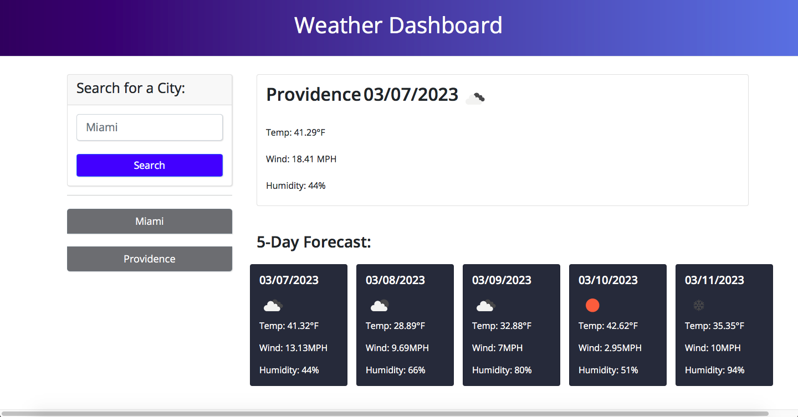
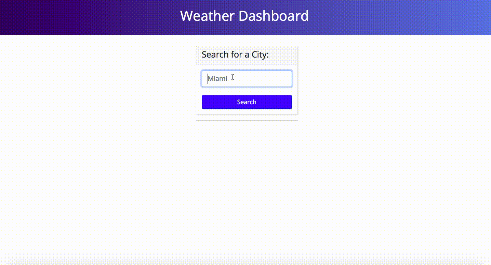

# Weather App

## Description

This weather web app is meant to help users who may be traveling to different cities search the current weather and the five-day forecast of the destination. It uses the OpenWeatherAPI to retrieve the relevant weather and forecast data. Every city the user searches for is added to a list of buttons, which, when clicked, will also display the current weather and forecast information. 

## User Story

```
AS A traveler
I WANT to see the weather outlook for multiple cities
SO THAT I can plan a trip accordingly
```

## Acceptance Criteria

```
GIVEN a weather dashboard with form inputs
WHEN I search for a city
THEN I am presented with current and future conditions for that city and that city is added to the search history
WHEN I view current weather conditions for that city
THEN I am presented with the city name, the date, an icon representation of weather conditions, the temperature, the humidity, and the wind speed
WHEN I view future weather conditions for that city
THEN I am presented with a 5-day forecast that displays the date, an icon representation of weather conditions, the temperature, the wind speed, and the humidity
WHEN I click on a city in the search history
THEN I am again presented with current and future conditions for that city
```

## Mock-Up

The following image and gif show the web application's appearance and functionality:





### Link to Deployed Site

## Notes on Code Source
ASKBCS helped with lines 67-72 on script.js file, as well as lines 94-95

The location.reload() aspect of line 243 on script.js was found on Stack Overflow

Line 122 on script.js was also done with the help of Stack Overflow


- - -
© 2022 edX Boot Camps LLC. Confidential and Proprietary. All Rights Reserved.
